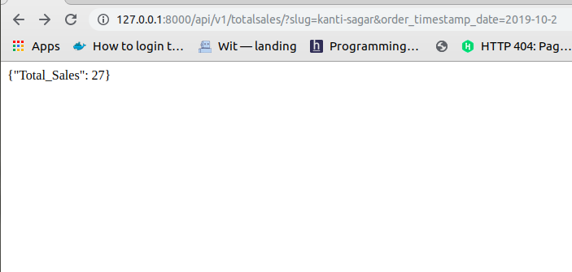
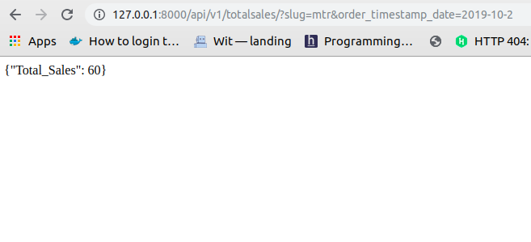
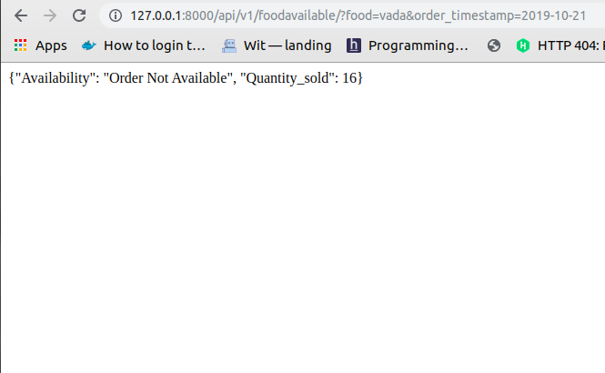
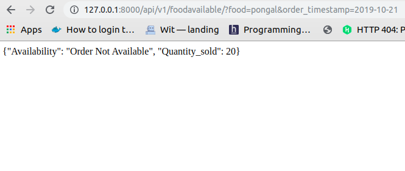
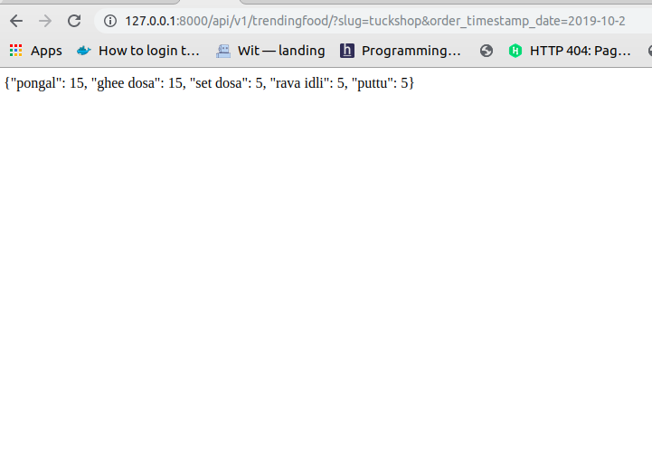
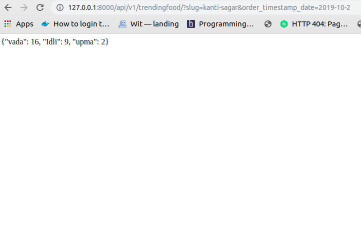
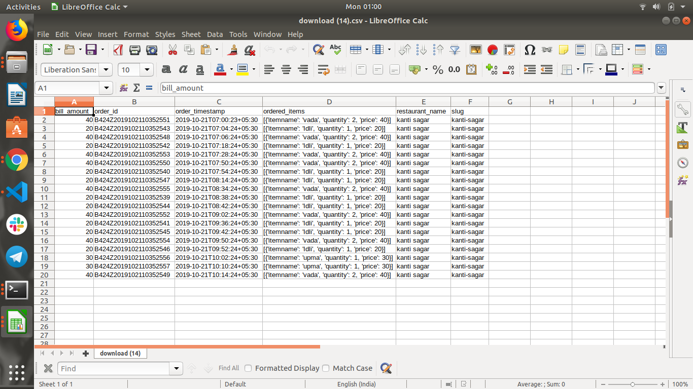

# RestaurantDetailAPI

Creating a Restaurant API to fetch the date as per the the request given below:

- Restaurant wise sales for a given restaurant
- Availability of food item with sold quantity detail.
- Trending item for a given restaurant
- Dump the Queryset into a CSV file for a given restaurant.


## Tech Stack Used

- Django 2.2 and Python 3.7
- PostgreSQL
- Custom user model
- Token-based auth
- Virtualenv
- Docker
- Docker-Compose
- Test Driven Development
- Flaske8
- Visual Studio Code


## How to setup

1.  Make sure Python 3.7x and virtualenv are already installed.

2.  Clone the repo and configure the virtual environment:

```
$ git clone https://github.com/shankarj67/Django-RESTAPI.git
$ cd src
$ pip install -r requirements.txt
$ python manage.py makemigrations 
$ python manage.py migrate
$ python manage.py runserver

```

If using Docker
```
$ docker build .
$ docker-compose run web python /code/manage.py makemigrations --noinput
$ docker-compose run web python /code/manage.py migrate --noinput
$ docker-compose run web python /code/manage.py createsuperuser
$ docker-compose up 


```

# API Endpoints

Login with your superuser account to view all the API because of the authenticated implemented.
All the results are in JSON format which can be easily consumed by any of the frontend framework.


Use case 1:

Total sales for Kanti-sagar restaurant and MTR

Url Endpoint: http://127.0.0.1:8000/api/v1/totalsales/?slug=kanti-sagar&order_timestamp_date=2019-10-2

Screenshot:



Use Case 2:

Checking if food item is available againist the current timing of the query and if item is available then calculate how many items are sold.

Url Endpoint: http://127.0.0.1:8000/api/v1/foodavailable/?food=vada&order_timestamp=2019-10-21

Current timing is 1:00AM and item is not available at that time




Use Case 3:

Calculate the top trending item for the provided restaurant

Url Endpoint: http://127.0.0.1:8000/api/v1/trendingfood/?slug=tuckshop&order_timestamp_date=2019-10-2




Use case 4:

Dump the csv file of a given restaurant by date.

Url Endpoint: http://127.0.0.1:8000/api/v1/dump/?slug=kanti-sagar&order_timestamp_date=2019-10-2




# Test

There are two simple test to check the models and views inside api/tests

To run the test

```
$ python manage.py run test
```

If using docker

```
$ docker-compose run web python manage.py run test
```

# Code Logic

There are total three app used in this project: 
- restaurant: having all the details such as fooditem and orderdetail.
- users: This contains all the information regarding users
- api: This has all the business logic and url endpoints.

There are two seperate file for all the business logic in api/services.py and api/logic.py which has all the business logic for the usecase.

# Roadmap

- Add continous integration 
- Deploy this on Heroku
- Add more test
- Add React Frontend
- Documentation using Swagger

